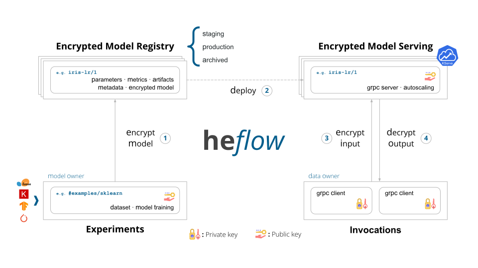

# HEflow: A Privacy-Preserving Machine Learning Lifecycle Platform

HEflow is a platform to streamline privacy-preserving machine learning
development, including tracking experiments, packaging code into reproducible
runs, and sharing and deploying encrypted models. Built on top of
[MLflow](https://github.com/mlflow/mlflow),
[Seldon MLServer](https://github.com/SeldonIO/MLServer) and
[OpenMined TenSEAL](https://github.com/OpenMined/TenSEAL), HEflow offers a set
of lightweight homomorphic encryption APIs that can be used with any existing
machine learning application or library (scikit-learn, Keras, TensorFlow,
PyTorch, etc), wherever you currently run ML code (e.g. in notebooks, standalone
applications, or the cloud).

[](https://badge.fury.io/py/heflow)

## Homomorphic Encryption (HE)

Homomorphic encryption differs from typical encryption methods in that it allows
computation to be performed directly on encrypted data without requiring access
to a secret key. The result of such a computation remains in encrypted form, and
can at a later point be revealed by the owner of the secret key. This
ground-breaking technology has enabled industry and government to provide
never-before enabled capabilities for outsourced computation securely.

Homomorphic encryption workflows, for privacy-preserving machine learning,
involve three entities:

1. an ML model owner,

2. a cloud server that performs model inference on HE encrypted data using the
pre-computed ML model, and

3. a user who sends confidential data to the cloud for model inference.

In all cases, the cloud should learn nothing about the underlying encrypted
data.

## Privacy-Preserving Machine Learning Operations (PPMLOps)

PPMLOps is a set of processes and automated steps to manage code, data, and
encrypted models. This section describes a typical PPMLOps workflow.


*PPMLOps using HEflow*

1. **Experiments**

	Data scientists develop, train and tune the model on the production data,
	then they encrypt &#9312; and register it with the Encrypted Model Registry.
	Model quality is evaluated by testing on held-out production data. This
	pipeline can be triggered by code changes or by automated retraining jobs.

2. **Encrypted Model Registry**

	Autologging saves a record of the training and evaluation process, which
	includes model metrics, parameters, tags, and the encrypted model itself.
	When training and hyperparameter tuning are complete, the data scientist
	registers the final encrypted model artifact in the Encrypted Model Registry
	for the production environment. This records a link between the encrypted
	model and the code used to generate it.

2. **Encrypted Model Serving**

	A continuous deployment (CD) process takes new encrypted models and deploys
	&#9313; them for low-latency online serving (APIs). Options include cloud
	provider serving endpoints, or custom serving applications.

2. **Invocations**

	The serving system loads the Production encrypted model version from the
	Encrypted Model Registry. For each request, it scores the encrypted data
	&#9314;, and returns encrypted predictions &#9315;.

## What is HEflow?

HEflow is an open source platform developed by InAccel to help manage the
complete privacy-preserving machine learning lifecycle with enterprise
reliability, security and scale. It tackles four primary functions:

### :hammer_and_wrench: Encrypted Model development

Accelerate and simplify privacy-preserving machine learning lifecycle management
with a standardized framework for developing production-ready PPML models. With
HEflow, you can bootstrap PPML projects, perform rapid iteration with ease and
ship high-quality encrypted models to production at scale.

### :clipboard: Experiment tracking

Run experiments with any ML library, framework or language, and automatically
keep track of parameters, metrics, code and encrypted models from each
experiment. By using HEflow, you can securely share, manage and compare
experiment results along with corresponding artifacts and code versions.

### :jigsaw: Encrypted Model management

Use one central place to discover and share PPML models, collaborate on moving
them from experimentation to online testing and production, integrate with
approval and governance workflows and CI/CD pipelines, and monitor PPML
deployments and their performance. HEflow facilitates sharing of expertise and
knowledge, and helps you stay in control.

### :package: Encrypted Model deployment

Quickly deploy production encrypted models for batch inference or as
[gRPC](https://github.com/grpc/grpc) homomorphic encryption APIs using built-in
integration with Docker containers or
[KServe](https://github.com/kserve/kserve). With HEflow, you can operationalize
and monitor production encrypted models to scale based on the business needs.

## Installing

Install HEflow from PyPI via `pip install heflow`

## Official HEflow Docker Image

The official HEflow Docker image is available on Docker Hub at
https://hub.docker.com/r/inaccel/heflow.

```sh
# Pull the latest version
docker pull inaccel/heflow
```
